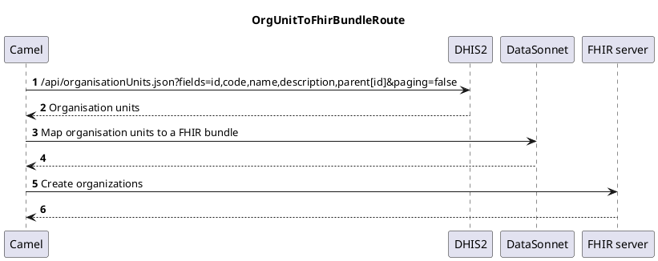

About
=====

This Apache Camel application shows how DHIS2 resources can be mapped into their FHIR counterparts with [DataSonnet](https://datasonnet.com/) and pushed as bundles to a FHIR server. In contrast with the `dhis2-to-fhir-bundle` example, DataSonnet provides a template-based way to mapping resources.

### How to run

1. Open `dhis2-to-fhir-bundle/src/main/resources/application.yml` and set:
   1. `dhis2-to-fhir.dhis2.base-url` to the DHIS2 server's address
   2. `dhis2-to-fhir.dhis2.username` to the DHIS2 account username
   3. `dhis2-to-fhir.dhis2.password` to the DHIS2 account password
   4. `dhis2-to-fhir.fhir.server-url` to the FHIR server's address
   
2. From your terminal, change the current directory to `dhis2-to-fhir-bundle-datasonnet` and run `mvn spring-boot:run`

### UML Sequence Diagrams

```
                                                              OrgUnitToFhirBundleRoute                                                          
                                                                                                                                                
     ┌─────┐                                                                                ┌─────┐          ┌──────────┐          ┌───────────┐
     │Camel│                                                                                │DHIS2│          │DataSonnet│          │FHIR server│
     └──┬──┘                                                                                └──┬──┘          └────┬─────┘          └─────┬─────┘
        │𝟏 /api/organisationUnits.json?fields=id,code,name,description,parent[id]&paging=false │                  │                      │      
        │─────────────────────────────────────────────────────────────────────────────────────>│                  │                      │      
        │                                                                                      │                  │                      │      
        │                                𝟐 Organisation units                                  │                  │                      │      
        │<─ ─ ─ ─ ─ ─ ─ ─ ─ ─ ─ ─ ─ ─ ─ ─ ─ ─ ─ ─ ─ ─ ─ ─ ─ ─ ─ ─ ─ ─ ─ ─ ─ ─ ─ ─ ─ ─ ─ ─ ─ ─ ─│                  │                      │      
        │                                                                                      │                  │                      │      
        │                               𝟑 Map organisation units to a FHIR bundle              │                  │                      │      
        │────────────────────────────────────────────────────────────────────────────────────────────────────────>│                      │      
        │                                                                                      │                  │                      │      
        │                                                   𝟒                                  │                  │                      │      
        │<─ ─ ─ ─ ─ ─ ─ ─ ─ ─ ─ ─ ─ ─ ─ ─ ─ ─ ─ ─ ─ ─ ─ ─ ─ ─ ─ ─ ─ ─ ─ ─ ─ ─ ─ ─ ─ ─ ─ ─ ─ ─ ─ ─ ─ ─ ─ ─ ─ ─ ─ ─ │                      │      
        │                                                                                      │                  │                      │      
        │                                                    𝟓 Create organizations            │                  │                      │      
        │───────────────────────────────────────────────────────────────────────────────────────────────────────────────────────────────>│      
        │                                                                                      │                  │                      │      
        │                                                              𝟔                       │                  │                      │      
        │<─ ─ ─ ─ ─ ─ ─ ─ ─ ─ ─ ─ ─ ─ ─ ─ ─ ─ ─ ─ ─ ─ ─ ─ ─ ─ ─ ─ ─ ─ ─ ─ ─ ─ ─ ─ ─ ─ ─ ─ ─ ─ ─ ─ ─ ─ ─ ─ ─ ─ ─ ─ ─ ─ ─ ─ ─ ─ ─ ─ ─ ─ ─ ─│      
     ┌──┴──┐                                                                                ┌──┴──┐          ┌────┴─────┐          ┌─────┴─────┐
     │Camel│                                                                                │DHIS2│          │DataSonnet│          │FHIR server│
     └─────┘                                                                                └─────┘          └──────────┘          └───────────┘
```

### PlantUML Descriptions


