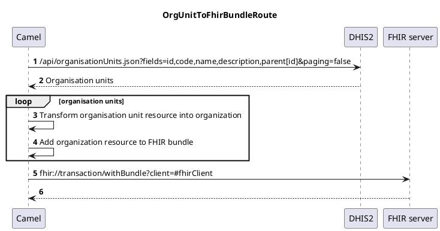
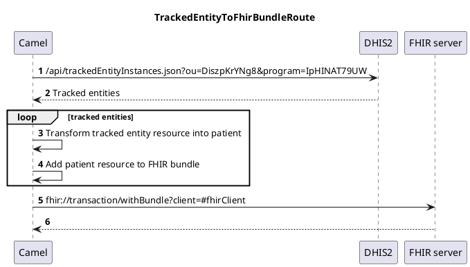
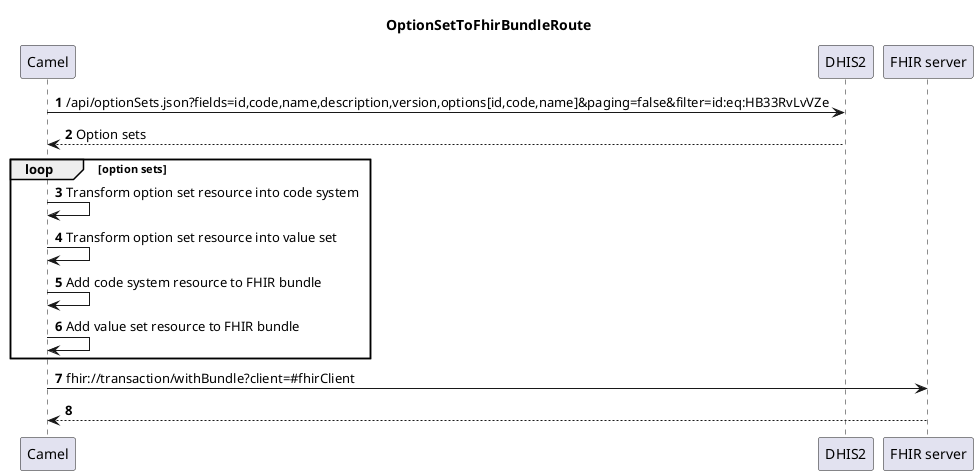

About this example
==================

This Apache Camel application shows how DHIS2 resources can be turned into their FHIR counterparts and pushed as bundles to a FHIR server. Concretely, [organisation units](https://docs.dhis2.org/en/implement/database-design/organisation-units.html) are transformed into [organizations](https://hl7.org/fhir/R4/organization.html), [tracked entities](https://docs.dhis2.org/en/develop/using-the-api/dhis-core-version-240/tracker.html?h=tracked+entity+2.40#tracked-entity) into [patients](https://hl7.org/fhir/R4/patient.html), and [option sets](https://docs.dhis2.org/en/use/user-guides/dhis-core-version-240/configuring-the-system/metadata.html?h=option+sets+2.40#about_option_set) into [code systems](https://hl7.org/fhir/R4/codesystem.html) as well as [value sets](https://hl7.org/fhir/R4/valueset.html).

### How to run

1. Open `dhis2-to-fhir-bundle/src/main/resources/application.yml` and set:
   1. `dhis2-to-fhir.dhis2.base-url` to the DHIS2 server's address
   2. `dhis2-to-fhir.dhis2.username` to the DHIS2 account username
   3. `dhis2-to-fhir.dhis2.password` to the DHIS2 account password
   4. `dhis2-to-fhir.fhir.server-url` to the FHIR server's address
   
2. From your terminal, change the current directory to `dhis2-to-fhir-bundle` and run `mvn spring-boot:run`

### UML sequence diagrams

```
                                                           OrgUnitToFhirBundleRoute                                                      
                                                                                                                                         
                    ┌─────┐                                                                                ┌─────┐          ┌───────────┐
                    │Camel│                                                                                │DHIS2│          │FHIR server│
                    └──┬──┘                                                                                └──┬──┘          └─────┬─────┘
                       │𝟏 /api/organisationUnits.json?fields=id,code,name,description,parent[id]&paging=false │                   │      
                       │─────────────────────────────────────────────────────────────────────────────────────>│                   │      
                       │                                                                                      │                   │      
                       │                                𝟐 Organisation units                                  │                   │      
                       │<─ ─ ─ ─ ─ ─ ─ ─ ─ ─ ─ ─ ─ ─ ─ ─ ─ ─ ─ ─ ─ ─ ─ ─ ─ ─ ─ ─ ─ ─ ─ ─ ─ ─ ─ ─ ─ ─ ─ ─ ─ ─ ─│                   │      
                       │                                                                                      │                   │      
                       │                                                                                      │                   │      
          ╔═══════╤════╪═════════════════════════════════════════════════════════════════╗                    │                   │      
          ║ LOOP  │  organisation units                                                  ║                    │                   │      
          ╟───────┘    │                                                                 ║                    │                   │      
          ║            ────┐                                                             ║                    │                   │      
          ║                │ 𝟑 Transform organisation unit resource into organization    ║                    │                   │      
          ║            <───┘                                                             ║                    │                   │      
          ║            │                                                                 ║                    │                   │      
          ║            ────┐                                                             ║                    │                   │      
          ║                │ 𝟒 Add organization resource to FHIR bundle                  ║                    │                   │      
          ║            <───┘                                                             ║                    │                   │      
          ╚════════════╪═════════════════════════════════════════════════════════════════╝                    │                   │      
                       │                                                                                      │                   │      
                       │                           𝟓 fhir://transaction/withBundle?client=#fhirClient         │                   │      
                       │─────────────────────────────────────────────────────────────────────────────────────────────────────────>│      
                       │                                                                                      │                   │      
                       │                                                   𝟔                                  │                   │      
                       │<─ ─ ─ ─ ─ ─ ─ ─ ─ ─ ─ ─ ─ ─ ─ ─ ─ ─ ─ ─ ─ ─ ─ ─ ─ ─ ─ ─ ─ ─ ─ ─ ─ ─ ─ ─ ─ ─ ─ ─ ─ ─ ─ ─ ─ ─ ─ ─ ─ ─ ─ ─ ─│      
                    ┌──┴──┐                                                                                ┌──┴──┐          ┌─────┴─────┐
                    │Camel│                                                                                │DHIS2│          │FHIR server│
                    └─────┘                                                                                └─────┘          └───────────┘
```

```
                                                TrackedEntityToFhirBundleRoute                                            
                                                                                                                          
                    ┌─────┐                                                                 ┌─────┐          ┌───────────┐
                    │Camel│                                                                 │DHIS2│          │FHIR server│
                    └──┬──┘                                                                 └──┬──┘          └─────┬─────┘
                       │𝟏 /api/trackedEntityInstances.json?ou=DiszpKrYNg8&program=IpHINAT79UW  │                   │      
                       │──────────────────────────────────────────────────────────────────────>│                   │      
                       │                                                                       │                   │      
                       │                          𝟐 Tracked entities                           │                   │      
                       │<─ ─ ─ ─ ─ ─ ─ ─ ─ ─ ─ ─ ─ ─ ─ ─ ─ ─ ─ ─ ─ ─ ─ ─ ─ ─ ─ ─ ─ ─ ─ ─ ─ ─ ─ │                   │      
                       │                                                                       │                   │      
                       │                                                                       │                   │      
          ╔═══════╤════╪═════════════════════════════════════════════════════════╗             │                   │      
          ║ LOOP  │  tracked entities                                            ║             │                   │      
          ╟───────┘    │                                                         ║             │                   │      
          ║            ────┐                                                     ║             │                   │      
          ║                │ 𝟑 Transform tracked entity resource into patient    ║             │                   │      
          ║            <───┘                                                     ║             │                   │      
          ║            │                                                         ║             │                   │      
          ║            ────┐                                                     ║             │                   │      
          ║                │ 𝟒 Add patient resource to FHIR bundle               ║             │                   │      
          ║            <───┘                                                     ║             │                   │      
          ╚════════════╪═════════════════════════════════════════════════════════╝             │                   │      
                       │                                                                       │                   │      
                       │                    𝟓 fhir://transaction/withBundle?client=#fhirClient │                   │      
                       │──────────────────────────────────────────────────────────────────────────────────────────>│      
                       │                                                                       │                   │      
                       │                                            𝟔                          │                   │      
                       │<─ ─ ─ ─ ─ ─ ─ ─ ─ ─ ─ ─ ─ ─ ─ ─ ─ ─ ─ ─ ─ ─ ─ ─ ─ ─ ─ ─ ─ ─ ─ ─ ─ ─ ─ ─ ─ ─ ─ ─ ─ ─ ─ ─ ─ │      
                    ┌──┴──┐                                                                 ┌──┴──┐          ┌─────┴─────┐
                    │Camel│                                                                 │DHIS2│          │FHIR server│
                    └─────┘                                                                 └─────┘          └───────────┘

```

```
                                                                            OptionSetToFhirBundleRoute                                                                        
                                                                                                                                                                              
                    ┌─────┐                                                                                                                     ┌─────┐          ┌───────────┐
                    │Camel│                                                                                                                     │DHIS2│          │FHIR server│
                    └──┬──┘                                                                                                                     └──┬──┘          └─────┬─────┘
                       │𝟏 /api/optionSets.json?fields=id,code,name,description,version,options[id,code,name]&paging=false&filter=id:eq:HB33RvLvVZe │                   │      
                       │──────────────────────────────────────────────────────────────────────────────────────────────────────────────────────────>│                   │      
                       │                                                                                                                           │                   │      
                       │                                                      𝟐 Option sets                                                        │                   │      
                       │<─ ─ ─ ─ ─ ─ ─ ─ ─ ─ ─ ─ ─ ─ ─ ─ ─ ─ ─ ─ ─ ─ ─ ─ ─ ─ ─ ─ ─ ─ ─ ─ ─ ─ ─ ─ ─ ─ ─ ─ ─ ─ ─ ─ ─ ─ ─ ─ ─ ─ ─ ─ ─ ─ ─ ─ ─ ─ ─ ─ ─ │                   │      
                       │                                                                                                                           │                   │      
                       │                                                                                                                           │                   │      
          ╔═══════╤════╪═════════════════════════════════════════════════════════╗                                                                 │                   │      
          ║ LOOP  │  option sets                                                 ║                                                                 │                   │      
          ╟───────┘    │                                                         ║                                                                 │                   │      
          ║            ────┐                                                     ║                                                                 │                   │      
          ║                │ 𝟑 Transform option set resource into code system    ║                                                                 │                   │      
          ║            <───┘                                                     ║                                                                 │                   │      
          ║            │                                                         ║                                                                 │                   │      
          ║            ────┐                                                     ║                                                                 │                   │      
          ║                │ 𝟒 Transform option set resource into value set      ║                                                                 │                   │      
          ║            <───┘                                                     ║                                                                 │                   │      
          ║            │                                                         ║                                                                 │                   │      
          ║            ────┐                                                     ║                                                                 │                   │      
          ║                │ 𝟓 Add code system resource to FHIR bundle           ║                                                                 │                   │      
          ║            <───┘                                                     ║                                                                 │                   │      
          ║            │                                                         ║                                                                 │                   │      
          ║            ────┐                                                     ║                                                                 │                   │      
          ║                │ 𝟔 Add value set resource to FHIR bundle             ║                                                                 │                   │      
          ║            <───┘                                                     ║                                                                 │                   │      
          ╚════════════╪═════════════════════════════════════════════════════════╝                                                                 │                   │      
                       │                                                                                                                           │                   │      
                       │                                              𝟕 fhir://transaction/withBundle?client=#fhirClient                           │                   │      
                       │──────────────────────────────────────────────────────────────────────────────────────────────────────────────────────────────────────────────>│      
                       │                                                                                                                           │                   │      
                       │                                                                      𝟖                                                    │                   │      
                       │<─ ─ ─ ─ ─ ─ ─ ─ ─ ─ ─ ─ ─ ─ ─ ─ ─ ─ ─ ─ ─ ─ ─ ─ ─ ─ ─ ─ ─ ─ ─ ─ ─ ─ ─ ─ ─ ─ ─ ─ ─ ─ ─ ─ ─ ─ ─ ─ ─ ─ ─ ─ ─ ─ ─ ─ ─ ─ ─ ─ ─ ─ ─ ─ ─ ─ ─ ─ ─ ─ ─ │      
                    ┌──┴──┐                                                                                                                     ┌──┴──┐          ┌─────┴─────┐
                    │Camel│                                                                                                                     │DHIS2│          │FHIR server│
                    └─────┘                                                                                                                     └─────┘          └───────────┘
```

### PlantUML Descriptions





