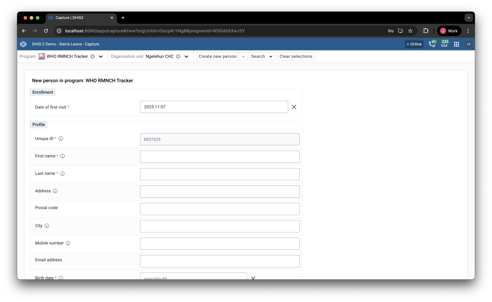
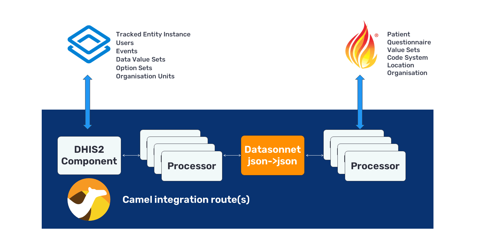

# DHIS2 to FHIR IPS Patient Mapping

This example demonstrates how to transform DHIS2 tracked entities from the WHO RMNCAH (Reproductive, Maternal, Newborn, Child and Adolescent Health) program into FHIR resources conformant to the [International Patient Summary (IPS)](https://build.fhir.org/ig/HL7/fhir-ips/en/StructureDefinition-Patient-uv-ips.html) profile. It provides a practical reference implementation for integrating DHIS2 maternal health data with FHIR-based health information exchanges.

## Core Example vs. Exercise

This repository consists of two parts: a core example and three exercises that extend the core functionality.

**Core Example (Already Implemented):**

The primary transformation maps patient demographics from DHIS2 tracked entity attributes to an IPS-conformant FHIR Patient resource. This demonstrates the complete pipeline from DHIS2 enrollment to FHIR server persistence, including:

- Mapping tracked entity attributes (first name, last name, date of birth, etc.) to FHIR Patient elements
- Using conditional updates (PUT with identifiers) to prevent duplicates
- Bundling resources in FHIR transaction bundles for atomic operations
- Real-time synchronization using Apache Camel middleware

**Hands-On Exercise (Three-Part Implementation):**

The exercise guides you through extending the core example by implementing three additional resource mappings:

1. **Practitioner Resource** - Map the DHIS2 user who created the enrollment to a FHIR Practitioner
2. **Observation Resource** - Map civil status (an attribute that doesn't fit in the IPS Patient profile) to a FHIR Observation
3. **AllergyIntolerance Resources** - Parse comma-separated allergy text and create individual AllergyIntolerance resources

These exercises demonstrate how to handle attributes that don't have direct mappings in the IPS Patient profile, ensuring a lossless transformation (at the attribute level) where all DHIS2 data is preserved in appropriate FHIR resources. 

## Quick Start

**Prerequisites:**
- Java 11+
- Maven 3.6+
- Node.js 18+
- Yarn
- Docker

After installing the prerequisites, run the entire stack with the following commands:

```bash
yarn install --frozen-lockfile
yarn build
yarn start
```

This will spin up a DHIS2 instance with the Sierra Leone demo database on `localhost:8080`, a HAPI FHIR server with the IPS profiles loaded on `localhost:8081/fhir`, and middleware that listens to tracked entity changes in the DHIS2 instance. 

To run the transformation tests:

```bash
cd fhir-sync-agent
mvn clean test -Dtest=IpsPatientMappingTestCase
```

## Walkthrough: Testing the Integration

Once the stack is running, you can test the end-to-end integration by creating a new patient enrollment in DHIS2 and observing the automatic synchronization to the FHIR server.

**Step 1: Create a Patient Enrollment in DHIS2**

1. Open your browser and navigate to `http://localhost:8080`
2. Log in with the default credentials (admin/district)
3. Open the **Capture** app from the main menu
4. Select the **WHO RMNCAH** program from the program dropdown
5. Select an organization unit of your choice from the organization tree
6. Click **New** to create a new enrollment
7. Fill out the enrollment form with patient demographics (first name, last name, date of birth, etc.)
8. Click **Save** to complete the enrollment



**Step 2: Observe the Synchronization**

The `fhir-sync-agent` middleware automatically detects the new tracked entity enrollment. The agent performs the following operations:

1. Fetches the complete tracked entity data from DHIS2 (including all attributes)
2. Passes the tracked entity JSON to the DataSonnet transformation script
3. Transforms the data into a FHIR transaction bundle with IPS-conformant resources
4. Pushes the bundle to the HAPI FHIR server using conditional updates

**Step 3: Verify the FHIR Resources**

1. Navigate to `http://localhost:8081/fhir/Patient` in your browser
2. The HAPI FHIR server returns a Bundle containing all Patient resources
3. Locate your newly created patient by searching for the name or identifier you entered
4. You can also query specific patients using FHIR search parameters, e.g., `http://localhost:8081/fhir/Patient?identifier=urn:dhis2:rmncah:patient-id|<your-patient-id>`

The patient data from DHIS2 is now available as a FHIR resource, ready for integration with other health information systems.

## Architecture

When someone enrolls in the WHO RMNCAH program in DHIS2, the sync agent detects the tracked entity changes, transforms the data into FHIR resources conformant to the IPS Patient profile, and pushes them to the HAPI FHIR server.

### Technology Stack

This example uses **Apache Camel** as middleware to connect DHIS2 with the FHIR server. Camel is a mature open-source integration framework with extensive connectors for health systems, making it a popular choice for DHIS2 integrations (also used by OpenMRS ETL, OpenEHR FHIR bridge, and others).

**Why Apache Camel?** It's flexible, used across multiple industries, and comes with built-in components for DHIS2, FHIR, HL7v2, and hundreds of other systems. This means you can adapt this example to connect DHIS2 with whatever systems your country needs.

**Transformation approach:** This example uses **DataSonnet**, a declarative mapping language for transforming JSON structures. Mappings are written once and can be updated without modifying application code. The alternative is procedural Java with the HAPI FHIR library, but DataSonnet offers simpler syntax and easier maintenance.



Want to learn more? See the [FHIR Page](https://dhis2.org/integration/fhir/) on the DHIS2 website.

**Key files:**

- `fhirBundle.ds` - Main transformation entry point
- `helperFunctions.libsonnet` - Utilities for extracting DHIS2 attributes and building FHIR data types
- `patientResource.libsonnet` - Builds the IPS Patient resource
- EXERCISE: `practitionerResource.libsonnet` - Maps the DHIS2 user who created the record
- EXERCISE: `observationResources.libsonnet` - Handles attributes that don't fit in Patient (civil status, allergies)

## FHIR Fundamentals

Before diving into the mapping, let's cover some FHIR basics. If you're already familiar with FHIR, skip to [How It Works](#how-it-works).

### What is FHIR?

[FHIR](https://www.hl7.org/fhir/R4/) (Fast Healthcare Interoperability Resources) is a standard for exchanging healthcare information electronically. It provides a common language that different health systems use to communicate and defines a standardized data exchange format. The FHIR specification serves as an entry point for understanding key components of FHIR-compliant data exchange, including [FHIR Resources](https://www.hl7.org/fhir/R4/resourcelist.html), [Data Types](https://www.hl7.org/fhir/R4/datatypes.html), and [Terminology Systems](https://www.hl7.org/fhir/R4/terminologies-systems.html).

### FHIR Resources

Everything in FHIR is a **resource**. A resource is a structured piece of healthcare information. What follows is a list of common resources and their DHIS2 counterparts:

- [Patient](https://www.hl7.org/fhir/R4/patient.html) - Demographics and administrative info about a person. In DHIS2, these demographics are often captured with tracked entity attributes.
- [Observation](https://www.hl7.org/fhir/R4/observation.html) - Measurements and facts (blood pressure, marital status, etc.). In DHIS2, such Observations are often captured as data elements within Tracker program stages. 
- [Practitioner](https://www.hl7.org/fhir/R4/practitioner.html) - Healthcare provider information. In DHIS2, you can use the [DHIS2 user](https://docs.dhis2.org/en/develop/using-the-api/dhis-core-version-241/users.html) metadata as source when populating a Practitioner resource. 
- [Location](https://www.hl7.org/fhir/R4/location.html) and [Organization](https://www.hl7.org/fhir/R4/organization.html) - Used to express organizations, their physical location and hierarchy. Can be used together to form a shared registry. In DHIS2, you can use [organisation units](https://docs.dhis2.org/en/develop/using-the-api/dhis-core-version-241/metadata.html#webapi_organisation_units) together with organisation unit groups and hierarchies as the source for Location and Organization resources. 

Each resource has a defined structure with fields (called `elements`). Here is a simple Patient resource:

```json
{
  "resourceType": "Patient",
  "id": "123",
  "name": [{
    "given": ["Jane"],
    "family": "Doe"
  }],
  "birthDate": "1997-04-18"
}
```

Each FHIR resource follows this structure, with a `resourceType`, `id`, and a list of `elements` to include. In the example above, we capture two elements: the `name` and `birthDate` of the patient.

### Data Types in FHIR

FHIR has two types of data:

**Primitive types** - Simple values like strings, dates, booleans:
```json
{
  "birthDate": "1997-04-18",
  "active": true
}
```

**Complex types** - Structured objects with multiple fields:
```json
{
  "name": [{
    "use": "official",
    "given": ["Jane"],
    "family": "Doe"
  }]
}
```

Notice that `name` is an array - FHIR often uses arrays even when there's only one value, because a person might have multiple names.

### What is a Bundle?

A **Bundle** is a container that holds multiple resources, allowing them to be sent together in a single operation. There are different types of bundles:

- **transaction** - All resources are created/updated together (all succeed or all fail)
- **batch** - Resources are processed independently
- **searchset** - Results from a search query

Here's a simple transaction bundle:

```json
{
  "resourceType": "Bundle",
  "type": "transaction",
  "entry": [
    {
      "resource": {
        "resourceType": "Patient",
        "name": [{"given": ["Jane"], "family": "Doe"}]
      },
      "request": {
        "method": "POST",
        "url": "Patient"
      }
    }
  ]
}
```

**Why use bundles?**
- Send multiple resources in a single HTTP request
- Ensure atomic operations (all succeed or all fail)
- Reference resources internally without knowing their server-assigned IDs yet
- Simplify cross-resource references within the same bundle (e.g., a `Patient` referencing a `Practitioner`) 

### Conditional Updates (PUT with Identifiers)

When synchronizing data repeatedly (like from DHIS2), you need to avoid creating duplicates. **Conditional updates** solve this problem:

```json
{
  "request": {
    "method": "PUT",
    "url": "Patient?identifier=urn:dhis2:patient-id|8437107"
  }
}
```

This says: "If a Patient with this identifier exists, update it. Otherwise, create it."

The explicit identifier URL is used because the FHIR server assigns its own resource IDs, but you control the identifiers. This allows you to look up resources using your system's IDs. Multiple identifiers can be added, enabling different systems to reference the same resource using their own identifier schemes.

### Implementation Guides and Profiles

FHIR resources are generic by default. An [Implementation Guide (IG)](https://build.fhir.org/ig/FHIR/ig-guidance/index.html) customizes FHIR for specific use cases and contexts by:

- Defining which elements are required
- Adding constraints and validation rules
- Specifying which code systems to use

A **Profile** is a set of rules from an IG that constrains a specific resource. For example:

- [Base FHIR Patient](https://www.hl7.org/fhir/R4/patient.html) has optional fields with no requirements on which to include or omit
- [IPS Patient profile](https://build.fhir.org/ig/HL7/fhir-ips/en/StructureDefinition-Patient-uv-ips.html) requires `name` and `birthDate` elements to be populated
- National profiles may require additional country-specific fields

**IPS (International Patient Summary)** is a globally-recognized IG for minimal patient summaries designed for cross-border care. When we refer to "IPS Patient," we mean a Patient resource that conforms to the IPS profile's requirements.

### Simple DataSonnet Example

Before examining the complex IPS mapping, let's start with a simple example transforming a DHIS2 tracked entity into a FHIR Patient:

**Input (DHIS2 Tracked Entity):**
```json
{
  "trackedEntity": "tracked-entity-id",
  "trackedEntityType": "nEenWmSyUEp",
  "orgUnit": "DiszpKrYNg8",
  "enrollments": [
    {
      "attributes": [
        { "attribute": "lZGmxYbs97q", "value": "ID001" },
        { "attribute": "w75KJ2mc4zz", "value": "Jane" },
        { "attribute": "zDhUuAYrxNC", "value": "Smith" },
        { "attribute": "gHGyrwKPzej", "value": "2000-01-01" }
      ]
    }
  ]
}
```

**DataSonnet transformation:**
```jsonnet
{
  resourceType: 'Patient',
  identifier: [{
    system: 'urn:dhis2:patient-id',
    value: body.enrollments[0].attributes[0].value
  }],
  name: [{
    given: [body.enrollments[0].attributes[1].value],
    family: body.enrollments[0].attributes[2].value
  }],
  birthDate: body.enrollments[0].attributes[3].value
}
```

**Output (FHIR Patient):**
```json
{
  "resourceType": "Patient",
  "identifier": [{
    "system": "urn:dhis2:patient-id",
    "value": "ID001"
  }],
  "name": [{
    "given": ["Jane"],
    "family": "Smith"
  }],
  "birthDate": "2000-01-01"
}
```
This example demonstrates basic DataSonnet syntax, but it has several limitations:

1. **Hard-coded array indices**: The transformation uses `body.enrollments[0].attributes[0].value`, `attributes[1].value`, etc. This approach is fragile because:
   - It assumes attributes always appear in a specific order
   - If attributes are reordered in DHIS2, the mapping breaks
   - There is no way to identify which attribute is which (first name vs. last name)

2. **No attribute ID matching**: The transformation doesn't use the actual attribute IDs (`lZGmxYbs97q`, `w75KJ2mc4zz`, etc.) to identify which value goes where.

3. **Assumes data exists**: There's no null checking or fallback logic if attributes are missing.

**How the Core Example Solves This:**

The core implementation uses helper functions to make the transformation more robust and maintainable:

```jsonnet
local helpers = import 'helperFunctions.libsonnet';

{
  resourceType: 'Patient',
  identifier: [{
    system: 'urn:dhis2:patient-id',
    value: helpers.getAttrValue(body, 'lZGmxYbs97q')  // Looks up by attribute ID
  }],
  name: [helpers.parseName(
    helpers.getAttrValue(body, 'w75KJ2mc4zz'),  // First name
    helpers.getAttrValue(body, 'zDhUuAYrxNC')   // Last name
  )],
  birthDate: helpers.getAttrValue(body, 'gHGyrwKPzej')
}
```

The `getAttrValue(tei, attributeId)` function searches through the enrollment-level attributes to find the correct value by ID, regardless of order. It also handles missing values gracefully. The `parseName()` function constructs a FHIR-compliant HumanName structure that satisfies IPS profile requirements.

This approach means the transformation works reliably even when some attributes are missing or reordered.


**DataSonnet Quick Reference:**

The [DataSonnet cookbook](https://datasonnet.github.io/datasonnet-mapper/datasonnet/latest/cookbook.html) provides practical examples for common transformation patterns. DataSonnet uses [Jsonnet syntax](https://jsonnet.org/learning/tutorial.html), so understanding Jsonnet will help you write transformations. Key concepts:

- **Reference input data**: Use `body` to access the input JSON
- **Build objects**: Use `{}` with field definitions like `resourceType: 'Patient'`
- **Build arrays**: Use `[]` like `[body.attributes[1].value]`
- **Access nested data**: Use dot notation like `body.trackedEntity` or bracket notation like `body.attributes[0].value`
- **Variables**: Define local variables with `local varName = value;`
- **Conditionals**: Use `if condition then value else otherValue`
- **Array comprehension**: `[expression for item in array]` to transform arrays
- **String interpolation**: Use `'text %s' % value` for formatting

Check out `docs/QUICK_REFERENCE.md` for other handy utility functions that are used in this example.

## How It Works

### Source: DHIS2 Tracked Entity

DHIS2 stores patient data as tracked entities with attributes at both the entity level and enrollment level:

```json
{
  "trackedEntity": "QfFVkOL8ixj",
  "attributes": [
    {"attribute": "w75KJ2mc4zz", "value": "Jane"},
    {"attribute": "zDhUuAYrxNC", "value": "Doe"}
  ],
  "enrollments": [{
    "attributes": [
      {"attribute": "gHGyrwKPzej", "value": "1997-04-18"},
      {"attribute": "ciq2USN94oJ", "value": "Single or widow"},
      {"attribute": "gu1fqsmoU8r", "value": "NSAIDS, Penicillin"}
    ]
  }]
}
```

### Target: FHIR Bundle

The transformation produces a transaction bundle with multiple resources:

```json
{
  "resourceType": "Bundle",
  "type": "transaction",
  "entry": [
    {
      "resource": {
        "resourceType": "Patient",
        "identifier": [{"value": "8437107", "system": "urn:dhis2:rmncah:patient-id"}],
        "name": [{"given": ["Jane"], "family": "Doe"}],
        "birthDate": "1997-04-18"
      },
      "request": {
        "method": "PUT",
        "url": "Patient?identifier=urn:dhis2:rmncah:patient-id|8437107"
      }
    },
    {
      "resource": {
        "resourceType": "Observation",
        "code": {"coding": [{"system": "http://loinc.org", "code": "45404-1"}]},
        "valueString": "Single or widow"
      },
      "request": {"method": "PUT", "url": "Observation?identifier=..."}
    },
    {
      "resource": {
        "resourceType": "AllergyIntolerance",
        "reaction": [{"manifestation": [{"text": "NSAIDS"}]}]
      },
      "request": {"method": "PUT", "url": "AllergyIntolerance?identifier=..."}
    }
  ]
}
```

## Core Concepts

### Helper Functions (`helperFunctions.libsonnet`)

These utilities make the transformation code cleaner:

**`getAttrValue(tei, attributeId)`** - Extracts attribute values with smart fallback. Checks enrollment attributes first (program-specific), then falls back to TEI attributes (general demographic).

**`parseName(firstName, lastName)`** - Combines name parts into a FHIR HumanName structure that satisfies IPS constraints (must have `given`, `family`, or `text`).

**`parseAddress(...)`**, **`buildTelecom(...)`** - Transform DHIS2 address and contact data into FHIR structures.

All helpers handle null values gracefully and use conditional field syntax to avoid empty objects.

Not everything in DHIS2 fits into a FHIR Patient resource. The IPS Patient profile has specific fields for demographics, but what about:

- Civil status? In the exercise, we use an `Observation` resource with LOINC code 45404-1 to capture this in FHIR. 
- Allergies? In the exercise, we use `AllergyIntolerance` resources (one per allergy)
- Who created the record? In the exercise, we create a Practitioner and link via the `generalPractitioner` element. 

In this way, nothing that is captured during the DHIS2 enrollment is lost in the transformation.

### Conditional Updates

The bundle uses `PUT` with identifier queries:

```
PUT Patient?identifier=urn:dhis2:rmncah:patient-id|8437107
```

This means:
- If a patient with that identifier exists it gets update
- If not - create it

This means that if you create a new enrollment in DHIS2 and need to make changes to the attributes, the resulting FHIR patient is updated instead of duplicated. This is critical for keeping DHIS2 and FHIR in sync.

## Hands-On Exercise

Want to learn by doing? Check out `docs/HANDS_ON_GUIDE.md` for a step-by-step exercise where you will:

1. Add a `Practitioner` resource (map DHIS2 user to FHIR Practitioner)
2. Add `Observation` for civil status
3. Handle multi-value attributes (splitting comma-separated allergies into separate `AllergyIntolerance` resources)

The exercise uses guided TODO files with hints, and you can check your work against the solution files in `/fhir-sync-agent/src/main/resources/solutions`.

## Key Files Reference

- **`fhir-sync-agent/src/main/resources/fhirBundle.ds`** - Entry point that orchestrates the transformation
- **`fhir-sync-agent/src/main/resources/helperFunctions.libsonnet`** - Reusable utilities (documented inline)
- **`fhir-sync-agent/src/main/resources/patientResource.libsonnet`** - Patient resource builder (see comments for attribute IDs)
- **`fhir-sync-agent/src/main/resources/observationResources.libsonnet`** - Observation and AllergyIntolerance builders
- **`fhir-sync-agent/src/test/java/.../IpsPatientMappingTestCase.java`** - Tests with HAPI FHIR validation

## Adapting This Example

To use this with your own DHIS2 instance:

1. **Identify your attribute IDs and/or data element IDs** - Look up the IDs in your DHIS2 metadata
2. **Update the constants** - Change `ATTR_FIRST_NAME`, `ATTR_DOB`, etc. in the resource libraries
3. **Adjust the identifier system** - Replace `urn:dhis2:rmncah:patient-id` with your system URI
4. **Add/remove resources** - Map additional attributes as needed
5. **Test thoroughly** - Run the validator against your FHIR server's profiles

## Resources

- [FHIR IPS Implementation Guide](http://hl7.org/fhir/uv/ips/)
- [DHIS2 Tracker API](https://docs.dhis2.org/en/develop/using-the-api/dhis-core-version-master/tracker.html)
- [DataSonnet Documentation](https://datasonnet.com/)
- [Jsonnet Tutorial](https://jsonnet.org/learning/tutorial.html)

## Support

Questions, issues or difficulties with the exercise? Open an issue on GitHub or reach out on the [DHIS2 Community of Practice](https://community.dhis2.org/).