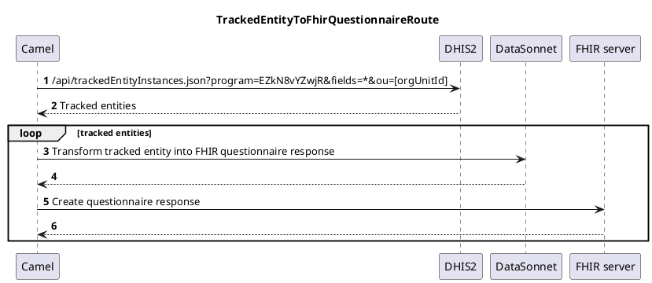

About
=====

This Apache Camel application is a proof-of-concept (PoC) that fetches [adverse events following immunization (AEFI)](https://www.who.int/teams/regulation-prequalification/regulation-and-safety/pharmacovigilance/guidance/aefi) from DHIS2 and turns them into FHIR questionnaire responses before proceeding to push these questionnaire responses onto a FHIR server. 

The PoC was developed in collaboration with the [Pan American Health Organization (PAHO)](https://www.paho.org) to assess the technical feasibility of having the national surveillance systems report to a FHIR-based regional database with the end goal of strengthening pharmacovigilance following immunization. [Visit the DHIS2 website to learn more](https://dhis2.org/paho-vaccine-safety/) about this initiative.

### How to run

1. Open `fhir-esave-paho/src/main/resources/application.yml` and set:
   1. `dhis2-to-fhir.dhis2.base-url` to the DHIS2 server's address
   2. `dhis2-to-fhir.dhis2.username` to the DHIS2 account username
   3. `dhis2-to-fhir.dhis2.password` to the DHIS2 account password
   4. `dhis2-to-fhir.dhis2.org-unit-ud` to the ID of the DHIS2 organisation unit to which the tracked entities belong to
   5. `dhis2-to-fhir.fhir.server-url` to the FHIR server's address
   
2. From your terminal, change the current directory to `fhir-esave-paho` and run `mvn spring-boot:run`

### UML Sequence Diagrams

```
                                                                   TrackedEntityToFhirQuestionnaireRoute                                                          
                                                                                                                                                                  
                    ┌─────┐                                                                         ┌─────┐          ┌──────────┐          ┌───────────┐          
                    │Camel│                                                                         │DHIS2│          │DataSonnet│          │FHIR server│          
                    └──┬──┘                                                                         └──┬──┘          └────┬─────┘          └─────┬─────┘          
                       │𝟏 /api/trackedEntityInstances.json?program=EZkN8vYZwjR&fields=*&ou=[orgUnitId] │                  │                      │                
                       │──────────────────────────────────────────────────────────────────────────────>│                  │                      │                
                       │                                                                               │                  │                      │                
                       │                              𝟐 Tracked entities                               │                  │                      │                
                       │<─ ─ ─ ─ ─ ─ ─ ─ ─ ─ ─ ─ ─ ─ ─ ─ ─ ─ ─ ─ ─ ─ ─ ─ ─ ─ ─ ─ ─ ─ ─ ─ ─ ─ ─ ─ ─ ─ ─ │                  │                      │                
                       │                                                                               │                  │                      │                
                       │                                                                               │                  │                      │                
          ╔═══════╤════╪═══════════════════════════════════════════════════════════════════════════════╪══════════════════╪══════════════════════╪═══════════════╗
          ║ LOOP  │  tracked entities                                                                  │                  │                      │               ║
          ╟───────┘    │                                                                               │                  │                      │               ║
          ║            │                   𝟑 Transform tracked entity into FHIR questionnaire response │                  │                      │               ║
          ║            │─────────────────────────────────────────────────────────────────────────────────────────────────>│                      │               ║
          ║            │                                                                               │                  │                      │               ║
          ║            │                                               𝟒                               │                  │                      │               ║
          ║            │<─ ─ ─ ─ ─ ─ ─ ─ ─ ─ ─ ─ ─ ─ ─ ─ ─ ─ ─ ─ ─ ─ ─ ─ ─ ─ ─ ─ ─ ─ ─ ─ ─ ─ ─ ─ ─ ─ ─ ─ ─ ─ ─ ─ ─ ─ ─ ─ ─│                      │               ║
          ║            │                                                                               │                  │                      │               ║
          ║            │                                            𝟓 Create questionnaire response    │                  │                      │               ║
          ║            │────────────────────────────────────────────────────────────────────────────────────────────────────────────────────────>│               ║
          ║            │                                                                               │                  │                      │               ║
          ║            │                                                           𝟔                   │                  │                      │               ║
          ║            │<─ ─ ─ ─ ─ ─ ─ ─ ─ ─ ─ ─ ─ ─ ─ ─ ─ ─ ─ ─ ─ ─ ─ ─ ─ ─ ─ ─ ─ ─ ─ ─ ─ ─ ─ ─ ─ ─ ─ ─ ─ ─ ─ ─ ─ ─ ─ ─ ─ ─ ─ ─ ─ ─ ─ ─ ─ ─ ─ ─ │               ║
          ╚════════════╪═══════════════════════════════════════════════════════════════════════════════╪══════════════════╪══════════════════════╪═══════════════╝
                    ┌──┴──┐                                                                         ┌──┴──┐          ┌────┴─────┐          ┌─────┴─────┐          
                    │Camel│                                                                         │DHIS2│          │DataSonnet│          │FHIR server│          
                    └─────┘                                                                         └─────┘          └──────────┘          └───────────┘          
```

### PlantUML Descriptions


